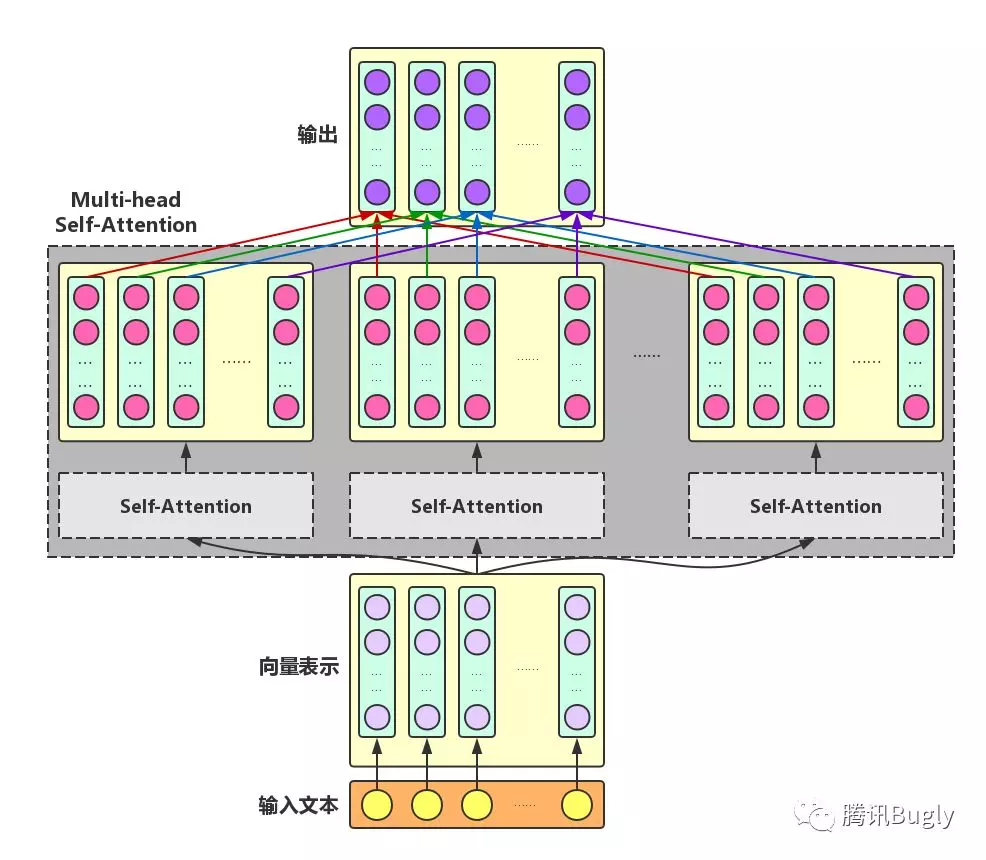
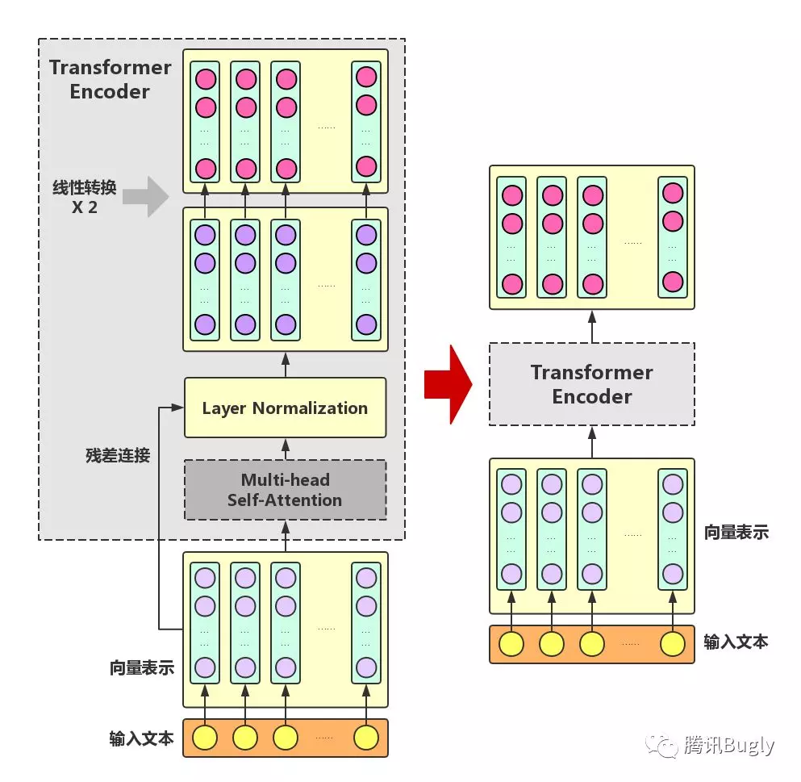
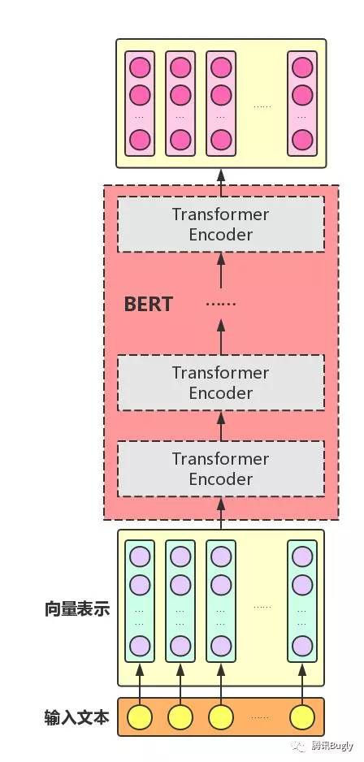

# BERT

## 目录
- BERT 模型的目的（输入,输出）
- BERT 的预训练任务
- BERT 的内部结构（ How 输入 ===> 输出)
- BERT 模型与现有方法效果比较 。
  
 
## 1. 模型的输入 / 输出
 
BERT 全称 BidirectionalEncoder Representations from Transformer 。  

BERT 模型的目标是利用大规模无标注语料训练、获得文本的语义表示(Representation)，然后将文本的语义表示在特定 NLP 任务中作微调，最终应用于该 NLP 任务。 

在基于深度神经网络的 NLP 方法中，文本中的字/词通常都用一维向量来表示（词向量）；在此基础上，神经网络会将文本中各个字或词的一维词向量作为输入，经过一系列复杂的转换后，输出一个一维词向量作为文本的语义表示。 
特别地，我们通常希望语义相近的字/词在特征向量空间上的距离也比较接近，如此一来，由字/词向量转换而来的文本向量也能够包含更为准确的语义信息。  

因此， BERT 模型的**主要输入**是文本中各个字/词的原始词向量，该向量既可以随机初始化，也可以利用 Word2Vector 等算法进行预训练以作为初始值；**输出**是文本中各个字/词融合了全文语义信息后的向量表示
  
### 模型输入 
- 字向量:
- 文本向量：该向量的取值在模型训练过程中自动学习，用于刻画文本的全局语义信息，并与单字/词的语义信息相融合  
- 位置向量：由于出现在文本不同位置的字/词所携带的语义信息存在差异  
  
### 模型输出
- 输入各字对应的融合全文语义信息后的向量表示

最后， BERT 模型将字向量、文本向量和位置向量的加和作为模型输入。特别地，在目前的 BERT 模型中，文章作者还将英文词汇作进一步切割，划分为更细粒度的语义单位（ WordPiece ），例如：将 playing 分割为 play 和 ##ing ；此外，对于中文，目前作者尚未对输入文本进行分词，而是直接将单字作为构成文本的基本单位。
 
### 不同的 NLP 任务，模型输入会有微调，对模型输出的利用也有差异
 
- 单文本分类任务：对于文本分类任务， BERT 模型在文本前插入一个 [CLS] 符号，并将该符号对应的输出向量作为整篇文本的语义表示，用于文本分类，如下图所示。可以理解为：与文本中已有的其它字/词相比，这个无明显语义信息的符号会更 "公平" 地融合文本中各个字/词的语义信息。
 
- 语句对分类任务：该任务的实际应用场景包括：问答（判断一个问题与一个答案是否匹配）、语句匹配（两句话是否表达同一个意思）等。对于该任务， BERT 模型除了添加 [CLS] 符号并将对应的输出作为文本的语义表示，还对输入的两句话用一个 [SEP] 符号作分割，并分别对两句话附加两个不同的文本向量以作区分，如下图所示。
 
- 序列标注任务：该任务的实际应用场景包括：中文分词 & 新词发现（标注每个字是词的首字、中间字或末字）、答案抽取（答案的起止位置）等。对于该任务， BERT 模型利用文本中每个字对应的输出向量对该字进行标注（分类） 
 
 
## 2. 模型的预训练任务
 
BERT 实际上是一个语言模型。语言模型通常采用大规模、与特定 NLP 任务无关的文本语料进行训练，其目标是学习语言本身应该是什么样的，其预训练过程就是逐渐调整模型参数，使得模型输出的文本语义表示能够刻画语言的本质，便于后续针对具体 NLP 任务作微调。为了达到这个目的， BERT 文章作者提出了两个预训练任务： Masked LM 和 Next Sentence Prediction 。
 
### 2.1 Masked LM
 
Masked LM 的任务描述为：给定一句话，随机抹去这句话中的一个或几个词，要求根据剩余词汇预测被抹去的几个词分别是什么。

BERT 模型的预训练过程其实就是在模仿我们学语言的过程。具体来说，文章作者在一句话中随机选择 15% 的词汇用于预测。对于在原句中被抹去的词汇， 80% 情况下采用一个特殊符号 [MASK] 替换， 10% 情况下采用一个任意词替换，剩余 10% 情况下保持原词汇不变。这么做的主要原因是：在后续微调任务中语句中并不会出现 [MASK] 标记，而且这么做的另一个好处是：预测一个词汇时，模型并不知道输入对应位置的词汇是否为正确的词汇（ 10% 概率），这就迫使模型更多地依赖于上下文信息去预测词汇，并且赋予了模型一定的纠错能力。
 
### 2.2 NextSentence Prediction
 
Next Sentence Prediction 的任务描述为：给定一篇文章中的两句话，判断第二句话在文本中是否紧跟在第一句话之后。

在实际预训练过程中，文章作者从文本语料库中随机选择 50% 正确语句对和 50% 错误语句对进行训练，与 Masked LM 任务相结合，让模型能够更准确地刻画语句乃至篇章层面的语义信息。
 
BERT 模型通过对 Masked LM 任务和 Next Sentence Prediction 任务进行联合训练，使模型输出的每个字/词的向量表示都能尽可能全面、准确地刻画输入文本（单句或语句对）的整体信息，为后续的微调任务提供更好的模型参数初始值。
 
## 3. 模型结构
 
BERT 模型的全称是： BidirectionalEncoder Representations from  Transformer ，也就是说， Transformer 是组成 BERT 的核心模块，而 Attention 机制又是 Transformer 中最关键的部分，因此，下面我们从 Attention 机制开始，介绍如何利用 Attention 机制构建 Transformer 模块，在此基础上，用多层 Transformer 组装 BERT 模型。
 
### 3.1 Attention 机制
 
Attention:  Attention 机制的中文名叫 "注意力机制" ，顾名思义，它的主要作用是让神经网络把 "注意力" 放在一部分输入上，即：区分输入的不同部分对输出的影响。这里，我们从增强字/词的语义表示这一角度来理解一下 Attention 机制。
 
一个字/词在一篇文本中表达的意思通常与它的上下文有关。为了有区分地利用上下文字信息增强目标字的语义表示，就可以用到 Attention 机制。
 
- Attention 机制  
  主要涉及到三个概念： Query 、 Key 和 Value 。在上面增强字的语义表示这个应用场景中，目标字及其上下文的字都有各自的原始 Value ， Attention 机制将目标字作为 Query 、其上下文的各个字作为 Key ， 并将 Query 与各个 Key 的相似性作为权重，把上下文各个字的 Value 融入目标字的原始 Value 中。如下图所示， Attention 机制将目标字和上下文各个字的语义向量表示作为输入，首先通过线性变换获得目标字的 Query 向量表示、上下文各个字的 Key 向量表示以及目标字与上下文各个字的原始 Value 表示，然后计算 Query 向量与各个 Key 向量的相似度作为权重，加权融合目标字的 Value 向量和各个上下文字的 Value 向量，作为 Attention 的输出，即：目标字的增强语义向量表示。
 
- Self-Attention:   
  对于输入文本，我们需要对其中的每个字分别增强语义向量表示，因此，我们分别将每个字作为 Query ，加权融合文本中所有字的语义信息，得到各个字的增强语义向量，如下图所示。在这种情况下， Query 、 Key 和 Value 的向量表示均来自于同一输入文本，因此，该 Attention 机制也叫 Self-Attention 。
 
- Multi-head Self-Attention:   
  为了增强 Attention 的多样性，文章作者进一步利用不同的 Self-Attention 模块获得文本中每个字在不同语义空间下的增强语义向量，并将每个字的多个增强语义向量进行线性组合，从而获得一个最终的与原始字向量长度相同的增强语义向量。

  
 
### 3.2 Transformer Encoder
 
在 Multi-headSelf-Attention 的基础上再添加一些 "佐料" ，就构成了大名鼎鼎的 Transformer Encoder 。实际上， Transformer 模型还包含一个 Decoder 模块用于生成文本，但由于 BERT 模型中并未使用到 Decoder 模块，因此这里对其不作详述。下图展示了 Transformer Encoder 的内部结构，可以看到， Transformer Encoder 在 Multi-head Self-Attention 之上又添加了三种关键操作：
 
- 残差连接 ResidualConnection  
  将模块的输入与输出直接相加，作为最后的输出。这种操作背后的一个基本考虑是：修改输入比重构整个输出更容易（ "锦上添花" 比 "雪中送炭" 容易多了！）。这样一来，可以使网络更容易训练。
 
- Layer Normalization  
  对某一层神经网络节点作 0 均值 1 方差的标准化。
 
- 线性转换  
  对每个字的增强语义向量再做两次线性变换，以增强整个模型的表达能力。这里，变换后的向量与原向量保持长度相同。
 

 
可以看到， Transformer Encoder 的输入和输出在形式上还是完全相同，因此， Transformer Encoder 同样可以表示为将输入文本中各个字的语义向量转换为相同长度的增强语义向量的一个黑盒。
 
### 3.3 BERT model
 
组装好 Transformer Encoder 之后，再把多个 Transformer Encoder堆叠起来既是BERT  

在论文中，作者分别用 12 层和 24 层 Transformer Encoder 组装了两套 BERT 模型，两套模型的参数总数分别为 110M 和 340M 。

 
## 4. BERT 模型的文本分类效果
 
聚焦文本分类任务，对比分析 BERT 模型在中 / 英文、不同规模数据集上的文本分类效果。基于 Google 预训练好的 BERT 模型(中文采用[chinese_L-12_H-768_A-12模型](https://storage.googleapis.com/bert_models/2018_11_03/chinese_L-12_H-768_A-12.zip) ； 英文采用[uncased_L-12_H-768_A-12模型](https://storage.googleapis.com/bert_models/2018_10_18/uncased_L-12_H-768_A-12.zip) )选择了 6 个数据集进行实验.
 
 
| 数据集            | 训练集大小 | 测试集大小 | 分类任务     | 类别数 | 语言类型 |
| ----------------- | ---------- | ---------- | ------------ | ------ | -------- |
| 商品评论情感分析   | 9653       | 1145       | 情感极性分类 | 3      | 中文     |
| Sentiment_XS      | 29613      | 11562      | 情感极性分类 | 2      | 中文     |
| 立场分析           | 2914       | 1249       | 立场分类     | 3      | 英文     |
| AG’s News         | 120000     | 7600       | 新闻分类     | 4      | 英文     |
| Yelp Review  Full | 650000     | 50000      | 情感分类     | 5      | 英文     |
| Yahoo! Answers    | 1400000    | 60000      | 问答系统     | 10     | 英文     |
 
BERT 模型在 AG’s News 数据集上取得了最高的分类准确率，在 Yelp Review Full 和 Yahoo! Answers 数据集上也都取得了次高的分类准确率。需要注意的是，目前仅使用 12 层 Transformer Encoder 结构的 BERT 模型进行实验，后续会进一步检验 24 层 TransformerEncoder 结构的 BERT 模型的分类效果，可以期待， BERT 模型的分类效果应该会随着网络结构的加深而进一步有所提高。

## NLP

### NLP历史
- 基于规则 (复杂人工定义的规则)
- 基于统计 (朴素贝叶斯NB,隐马尔科夫模型HMM)
- 基于深度学习 word embedding， LSTM

### 分类

- 自然语言理解(分词，词性标注，分类，相似性，句法分析)
- 自然语言生成(机器翻译，问答，自动摘要)

### 评估基准 

- 英文基准：[glue](https://gluebenchmark.com/tasks)
- 中文基准：[clue](https://www.cluebenchmarks.com/introduce.html)

### 模型

- 华为 Noah's Ark Lab
   https://github.com/huawei-noah/Pretrained-Language-Model
10.5B token, 中文维基+百科+新闻 

- 百度 
  https://github.com/PaddlePaddle/ERNIE
  v1.0, 9B token, weiki+baike+tieba
  v2.0, 15B token, Baike+News+Dialog

- Google
  https://github.com/google-research/bert